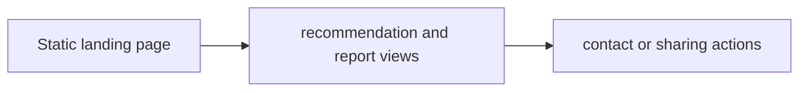

# JJ Shay Public Site Snapshot — Project Brief

## At a glance

| Field | Value |
|---|---|
| Portfolio area | Portfolio and knowledge |
| Repository | [jjshay/jjshay.com](https://github.com/jjshay/jjshay.com) |
| Status | Source available; runtime not revalidated in this documentation review |
| Evidence review | 2026-09-11; [commit 3d29b93](https://github.com/jjshay/jjshay.com/tree/3d29b934211bcb4b4a7a209ea986e058b419e10e) |

## Problem and intended value

A professional profile needs a compact way to present experience, recommendations, and research.

The intended value is a repeatable workflow whose inputs, transformations, and outputs can be inspected. Use the evidence below to distinguish implementation from business outcomes.

## Architecture and data flow

Static landing page → recommendation and report views → contact or sharing actions.

## Implementation evidence

| Source | Reading purpose |
|---|---|
| [index.html](../index.html) | Application entry point, interface, or integration boundary. |

The links above point to the current repository. The review reference identifies the version used to prepare this brief.

## Setup and operation

Use the existing [README](../README.md) for setup and operating commands. Configuration and dependency references: the source entry points and the existing README.

Start with sample or fixture inputs. Where external services are involved, configure a test account and check the distinction between a local preview, a generated artifact, and a remote write. Credentials and operational datasets are environment-specific.

## Validation and outcomes

**Review result:** Repository tree and referenced source reviewed. Existing application tests, hosted deployments, paid providers, and external mutations were not re-run in this documentation review.

No conventional test suite was identified in the reviewed repository tree; validation should begin with the next improvement below.

The source implements the workflow described above. No new revenue, accuracy, conversion, or production-uptime result is asserted by this documentation update.

Documentation itself is checked by `python3 scripts/check_project_docs.py`; that check validates this structure and its source references, not application behavior.

## Decisions and limitations

A single-page implementation is easy to host; this public snapshot may differ from the newer app-hub repository.

Keep provider-dependent observations dated and separate from deterministic transformations. State which assumptions a demonstration uses and which integrations it actually exercises.

## Interview talking points

- **Problem and product judgment:** Explain why this workflow mattered to its intended operator: A professional profile needs a compact way to present experience, recommendations, and research.
- **Technical walkthrough:** Trace one concrete input through this sequence: Static landing page → recommendation and report views → contact or sharing actions.
- **Engineering tradeoff:** A single-page implementation is easy to host; this public snapshot may differ from the newer app-hub repository.
- **Evidence and ownership:** Open the source links above, identify the specific design or implementation decisions you personally drove, and distinguish AI-assisted implementation from measured operating results.
- **What comes next:** Keep this historical public snapshot labeled and use jjshay-website for current app-hub implementation discussions.

## Next improvements

Keep this historical public snapshot labeled and use jjshay-website for current app-hub implementation discussions.

Record any follow-up result with a date, exact command or evaluation method, input scope, observed output, and limitations. Update `project.json` alongside this brief.

## Related projects

- [JJ Shay Portfolio](https://github.com/jjshay/jjshay) — Portfolio and knowledge.
- [JJ Shay Website and App Hub](https://github.com/jjshay/jjshay-website) — Portfolio and knowledge.

Some related repositories require authorized GitHub access.
